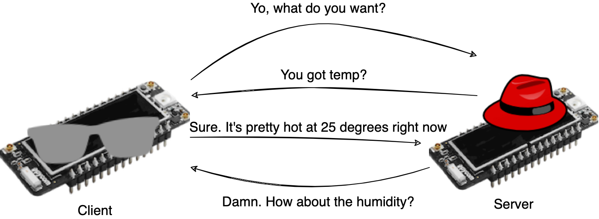

# Networking 1 - WiFi

Todays exercise is about using your LoPy's to create and connect to WiFi networks, and to use that connection to transfer data. 
The goal is to have 1 LoPy with the air quality sensor connect to a wifi network, hosted by another LoPy.
Then it should ask the other LoPy which data from the sensor it wants (humidity, CO2, Temperature) and reply with a measurement.

Since you only have 1 LoPy for each group, you should find a another group to pair up with, or your friendly neigbourhood TA if we are an uneven number of groups, and then decide which of you will be the wi-Fi access point (the 'host' of the network) and which will be the sensor device. 

Some ressources to get you started:

## WLAN
Below is a link to the documentation for using Wi-Fi on LoPy's. Note that `WLAN.AP` (for Access Point) is for the host of the network, and `WLAN.STA` (for station) is for the sensor-device connecting to the access point.

https://docs.pycom.io/tutorials/networks/wlan/

By default the WiFi on the Pycom devices uses it's internal antennas, which should be more than enough if you place the devices close together. If you want to use the external antenna for increased range or coolness factor, then remember to connect it before you enable it in software, and to disable it before disconnecting the antenna. ***If the external antenna port is on without an external antenna the device break***

## Sending and Receiving data
Here you are free to decide on how the devices should communicate. 
Pycom has examples setting up an HTTP Client and Server which is linked below, but you can use any other way you want.

- Client: https://docs.pycom.io/tutorials/networkprotocols/httpclient/
- Server: https://docs.pycom.io/tutorials/networkprotocols/webserver/

## Things to ponder

1. What network options beside Wi-Fi do you see for your indoor air sensor?
2. What are their benefits and disadvantages?
3. In particular, how would you compare Wi-Fi, Bluetooth, Mobile?
4. What are the strength and weaknesses of the way you chose to communicate?
5. How does it compare to e.g. HTTP? or others you know? (websockets, CoAP, telnet)

